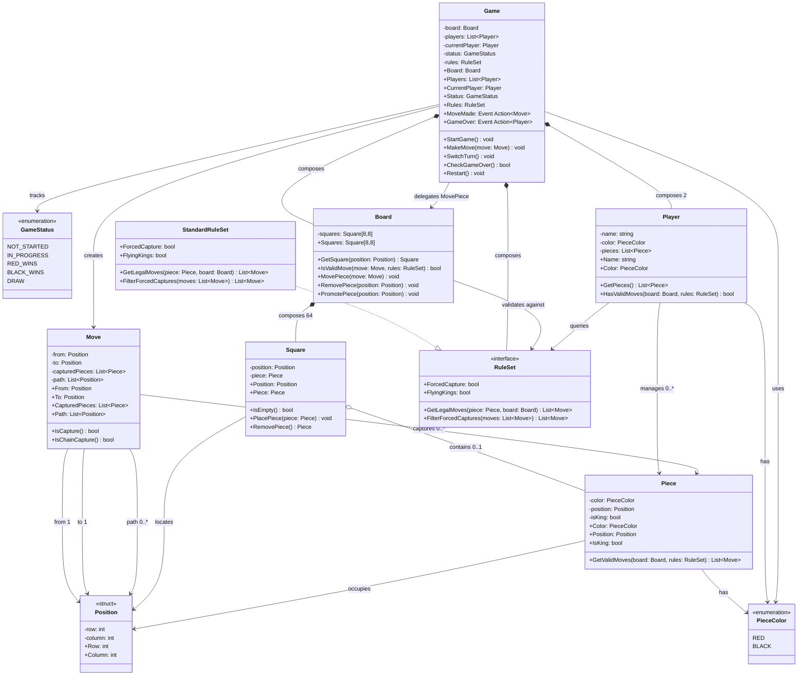

```mermaid

classDiagram
  direction TB

  %% Enumerations
  class PieceColor {
    <<enumeration>>
    RED
    BLACK
  }

  class GameStatus {
    <<enumeration>>
    NOT_STARTED
    IN_PROGRESS
    RED_WINS
    BLACK_WINS
    DRAW
  }

  %% Position Value Object
  class Position {
    <<struct>>
    -row: int
    -column: int
    +Row: int
    +Column: int
  }

  %% Single Piece class (no interface - only one piece type exists)
  class Piece {
    -color: PieceColor
    -position: Position
    -isKing: bool
    +Color: PieceColor
    +Position: Position
    +IsKing: bool
    +GetValidMoves(board: Board, rules: RuleSet) List~Move~
  }

  %% Board and Square
  class Square {
    -position: Position
    -piece: Piece
    +Position: Position
    +Piece: Piece
    +IsEmpty() bool
    +PlacePiece(piece: Piece) void
    +RemovePiece() Piece
  }

  class Board {
    -squares: Square[8,8]
    +Squares: Square[8,8]
    +GetSquare(position: Position) Square
    +IsValidMove(move: Move, rules: RuleSet) bool
    +MovePiece(move: Move) void
    +RemovePiece(position: Position) void
    +PromotePiece(position: Position) void
  }

  %% Move as pure data/intent - no Execute()
  class Move {
    -from: Position
    -to: Position
    -capturedPieces: List~Piece~
    -path: List~Position~
    +From: Position
    +To: Position
    +CapturedPieces: List~Piece~
    +Path: List~Position~
    +IsCapture() bool
    +IsChainCapture() bool
  }

  %% Rules extracted so Board isn't hardcoded to one variant
  class RuleSet {
    <<interface>>
    +ForcedCapture: bool
    +FlyingKings: bool
    +GetLegalMoves(piece: Piece, board: Board) List~Move~
    +FilterForcedCaptures(moves: List~Move~) List~Move~
  }

  class StandardRuleSet {
    +ForcedCapture: bool
    +FlyingKings: bool
    +GetLegalMoves(piece: Piece, board: Board) List~Move~
    +FilterForcedCaptures(moves: List~Move~) List~Move~
  }

  %% Player
  class Player {
    -name: string
    -color: PieceColor
    -pieces: List~Piece~
    +Name: string
    +Color: PieceColor
    +GetPieces() List~Piece~
    +HasValidMoves(board: Board, rules: RuleSet) bool
  }

  %% Game
  class Game {
    -board: Board
    -players: List~Player~
    -currentPlayer: Player
    -status: GameStatus
    -rules: RuleSet
    +Board: Board
    +Players: List~Player~
    +CurrentPlayer: Player
    +Status: GameStatus
    +Rules: RuleSet
    +MoveMade: Event Action~Move~
    +GameOver: Event Action~Player~
    +StartGame() void
    +MakeMove(move: Move) void
    +SwitchTurn() void
    +CheckGameOver() bool
    +Restart() void
  }

  %% Relationships

  %% Interface Implementation
  StandardRuleSet ..|> RuleSet

  %% Composition: Game owns Board
  Game *-- Board : composes

  %% Composition: Board owns 64 Squares
  Board *-- Square : composes 64

  %% Association: Square is the single source of truth for piece location
  Square o-- Piece : contains 0..1

  %% Composition: Game owns Players
  Game *-- Player : composes 2

  %% Association: Player has multiple pieces
  Player --> Piece : manages 0..*

  %% Association: Move references positions
  Move --> Position : from 1
  Move --> Position : to 1
  Move --> Position : path 0..*

  %% Association: Move may capture pieces (chain capture support)
  Move --> Piece : captures 0..*

  %% Dependency: Game uses Move; Board is the sole mutator
  Game --> Move : creates
  Game --> Board : delegates MovePiece

  %% Rules are pluggable and used by both Board and Player
  Game *-- RuleSet : composes
  Board --> RuleSet : validates against
  Player --> RuleSet : queries

  %% Value Object: Position used throughout
  Square --> Position : locates
  Piece --> Position : occupies

  %% Enumerations used
  Piece --> PieceColor : has
  Player --> PieceColor : has
  Game --> GameStatus : tracks
  Game --> PieceColor : uses
```