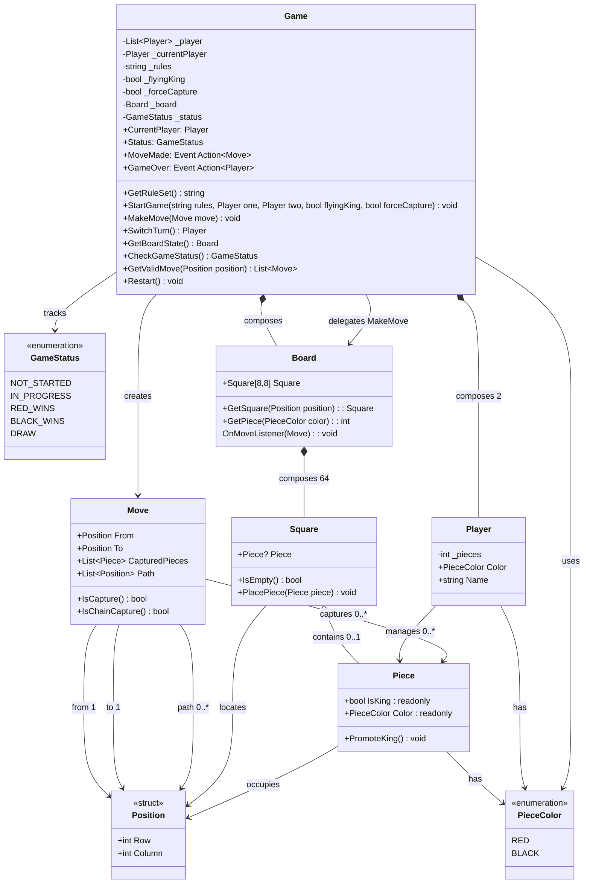

```mermaid
classDiagram
  direction TB

  %% Enumerations
  class PieceColor {
    <<enumeration>>
    RED
    BLACK
  }

  class GameStatus {
    <<enumeration>>
    NOT_STARTED
    IN_PROGRESS
    RED_WINS
    BLACK_WINS
    DRAW
  }

  %% Position Value Object
  class Position {
    <<struct>>
    +int Row
    +int Column
  }

  %% Single Piece class (no interface - only one piece type exists)
  class Piece {
    +bool IsKing : readonly
    +PieceColor Color : readonly
    +PromoteKing() void
  }

  %% Board and Square
  class Square {
    +Piece? Piece
    +IsEmpty() bool
    +PlacePiece(Piece piece) void
  }

  class Board {
    +Square[8,8] Square
    +GetSquare(Position position) : Square
    +GetPiece(PieceColor color) : int
    OnMoveListener(Move) : void
  }

  %% Move as pure data/intent - no Execute()
  class Move {
    +Position From
    +Position To
    +List~Piece~ CapturedPieces
    +List~Position~ Path
    +IsCapture() bool
    +IsChainCapture() bool
  }

  %% Player
  class Player {
    -int _pieces
    +PieceColor Color
    +string Name
  }

  %% Game
  class Game {
    -List~Player~ _player
    -Player _currentPlayer
    -string _rules
    -bool _flyingKing
    -bool _forceCapture
    -Board _board
    -GameStatus _status
    +CurrentPlayer: Player
    +Status: GameStatus
    +MoveMade: Event Action~Move~
    +GameOver: Event Action~Player~
    +GetRuleSet() string
    +StartGame(string rules, Player one, Player two, bool flyingKing, bool forceCapture) void
    +MakeMove(Move move) void
    +SwitchTurn() Player
    +GetBoardState() Board
    +CheckGameStatus() GameStatus
    +GetValidMove(Position position) List~Move~
    +Restart() void
  }

  %% Relationships


  %% Composition: Game owns Board
  Game *-- Board : composes

  %% Composition: Board owns 64 Squares
  Board *-- Square : composes 64

  %% Association: Square is the single source of truth for piece location
  Square o-- Piece : contains 0..1

  %% Composition: Game owns Players
  Game *-- Player : composes 2

  %% Association: Player has multiple pieces
  Player --> Piece : manages 0..*

  %% Association: Move references positions
  Move --> Position : from 1
  Move --> Position : to 1
  Move --> Position : path 0..*

  %% Association: Move may capture pieces (chain capture support)
  Move --> Piece : captures 0..*

  %% Dependency: Game uses Move; Board is the sole mutator
  Game --> Move : creates
  Game --> Board : delegates MakeMove


  %% Value Object: Position used throughout
  Square --> Position : locates
  Piece --> Position : occupies

  %% Enumerations used
  Piece --> PieceColor : has
  Player --> PieceColor : has
  Game --> GameStatus : tracks
  Game --> PieceColor : uses
```
