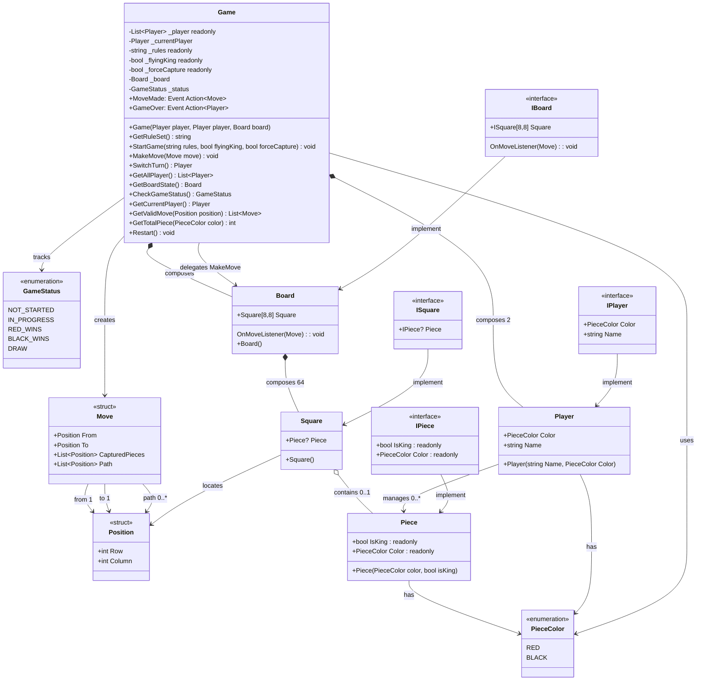

```mermaid
classDiagram
  direction TB

  %% Enumerations
  class PieceColor {
    <<enumeration>>
    RED
    BLACK
  }

  class GameStatus {
    <<enumeration>>
    NOT_STARTED
    IN_PROGRESS
    RED_WINS
    BLACK_WINS
    DRAW
  }

  %% Position Value Object
  class Position {
    <<struct>>
    +int Row
    +int Column
  }

  %% Interfaces
  class IPiece {
    <<interface>>
    +bool IsKing : readonly
    +PieceColor Color : readonly
  }

  class ISquare {
    <<interface>>
    +IPiece? Piece
  }

  class IBoard {
    <<interface>>
    +ISquare[8,8] Square
    OnMoveListener(Move) : void
  }

  class IPlayer {
    <<interface>>
    +PieceColor Color
    +string Name
  }

  %% Single Piece class (no interface - only one piece type exists)
  class Piece {
    +bool IsKing : readonly
    +PieceColor Color : readonly
    +Piece(PieceColor color, bool isKing)
  }

  %% Board and Square
  class Square {
    +Piece? Piece
    +Square()
  }

  class Board {
    +Square[8,8] Square
    OnMoveListener(Move) : void
    +Board()
  }


  %% Move as pure data/intent - no Execute()
  class Move {
    <<struct>>
    +Position From
    +Position To
    +List~Position~ CapturedPieces
    +List~Position~ Path
  }

  %% Player
  class Player {
    +PieceColor Color
    +string Name
    +Player(string Name, PieceColor Color)
  }

  %% Game
  class Game {
    -List~Player~ _player readonly
    -Player _currentPlayer
    -string _rules readonly
    -bool _flyingKing readonly
    -bool _forceCapture readonly
    -Board _board
    -GameStatus _status
    +MoveMade: Event Action~Move~
    +GameOver: Event Action~Player~
    +Game(Player player, Player player, Board board)
    +GetRuleSet() string
    +StartGame(string rules, bool flyingKing, bool forceCapture) void
    +MakeMove(Move move) void
    +SwitchTurn() Player
    +GetAllPlayer() List~Player~
    +GetBoardState() Board
    +CheckGameStatus() GameStatus
    +GetCurrentPlayer() Player
    +GetValidMove(Position position) List~Move~
    +GetTotalPiece(PieceColor color) int
    +Restart() void
  }

  %% Relationships


  %% Composition: Game owns Board
  Game *-- Board : composes

  %% Composition: Board owns 64 Squares
  Board *-- Square : composes 64

  %% Association: Square is the single source of truth for piece location
  Square o-- Piece : contains 0..1

  %% Composition: Game owns Players
  Game *-- Player : composes 2

  %% Association: Player has multiple pieces
  Player --> Piece : manages 0..*

  %% Association: Move references positions
  Move --> Position : from 1
  Move --> Position : to 1
  Move --> Position : path 0..*

  %% Dependency: Game uses Move; Board is the sole mutator
  Game --> Move : creates
  Game --> Board : delegates MakeMove


  %% Value Object: Position used throughout
  Square --> Position : locates

  %% Enumerations used
  Piece --> PieceColor : has
  Player --> PieceColor : has
  Game --> GameStatus : tracks
  Game --> PieceColor : uses

  %% Interface used
  IPiece --> Piece : implement
  IPlayer --> Player : implement
  ISquare --> Square : implement
  IBoard --> Board : implement
```
